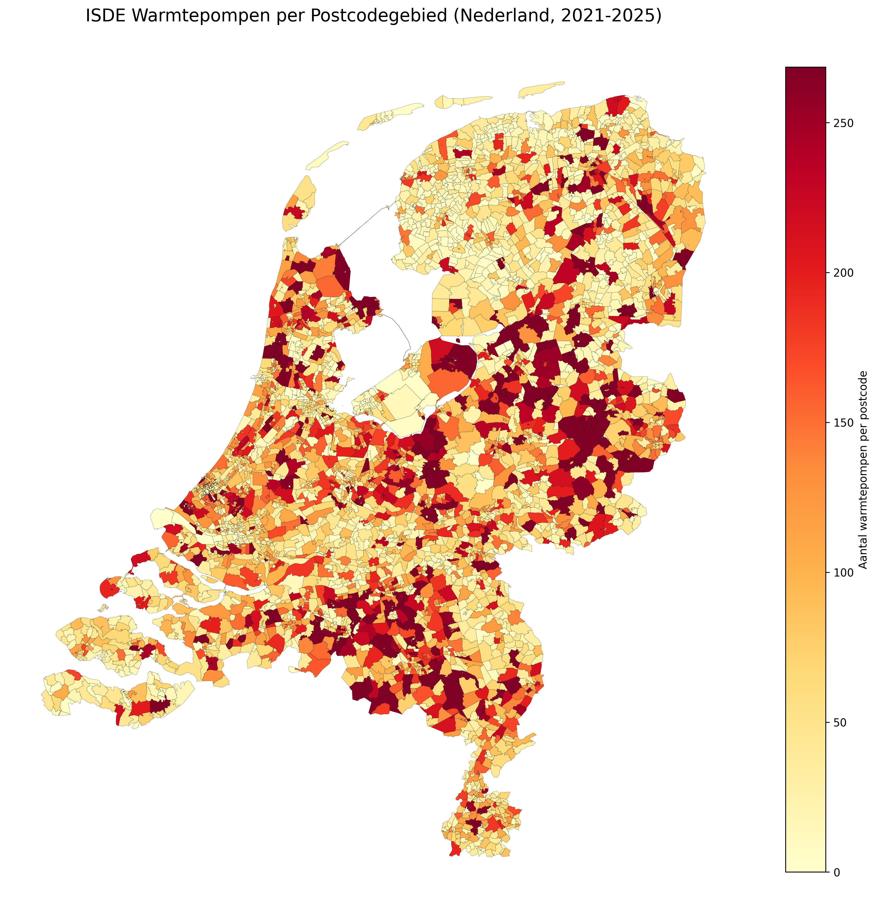
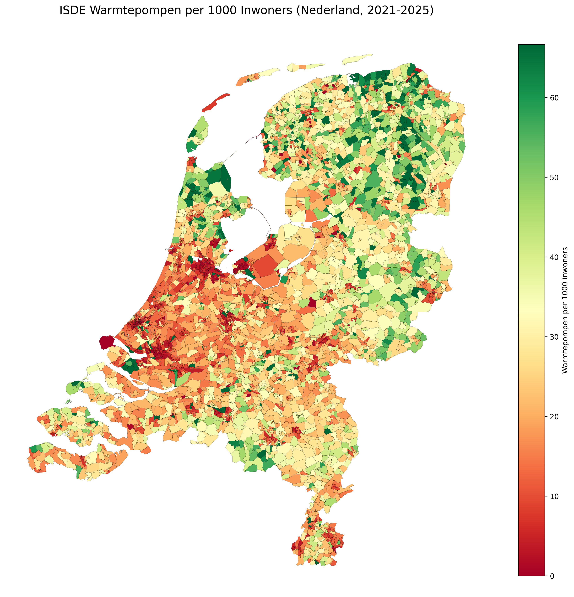

# ISDE Heat Pump Distribution Map - Netherlands

Choropleth maps showing the spatial distribution of **heat pump installations** across all 4-digit postcode areas in the Netherlands, based on the ISDE subsidy register published by RVO.nl.

## Output Maps

### Absolute count per postcode (2021-2025)



### Heat pumps per 1 000 inhabitants



The script also generates:

- **Per km²** static map (PDF/PNG)
- **Interactive HTML maps** (per capita, per km², choropleth) with tooltips showing postcode, municipality, counts, and population

## Data Sources

| Dataset | Source | Format |
|---------|--------|--------|
| ISDE subsidy register | [RVO.nl](https://www.rvo.nl/subsidies-financiering/isde) | Excel (`.xlsx`) |
| PC4 postcode boundaries | [PDOK / CBS](https://service.pdok.nl/cbs/postcode4/2024/wfs/v1_0) | GeoJSON (auto-downloaded) |
| Population per postcode | Extracted from CBS geodata | CSV (auto-cached) |

## Quick Start

```bash
pip install geopandas pandas matplotlib folium branca openpyxl requests
```

### First run (converts Excel to CSV, then generates maps)

```bash
python ISDE_map_NL_Heatpump_distribution.py --from-excel
```

### Subsequent runs (CSV already exists)

```bash
python ISDE_map_NL_Heatpump_distribution.py
```

Place the ISDE Excel file (`ISDE downloadbestand augustus 2025.xlsx`) in the project root before running.
Postcode boundaries are downloaded from PDOK on first run and cached locally.

## Project Structure

```
.
├── ISDE_map_NL_Heatpump_distribution.py   # Main script
├── README.md
├── .gitignore
├── .env                                    # API keys (not committed)
│
│  # Generated / cached data (git-ignored)
├── ISDE_Warmtepomp_all_rows.csv
├── nl_postcode4_boundaries.geojson
├── nl_postcode4_population.csv
│
│  # Output maps
├── ISDE_Warmtepompen_Matplotlib_2021-2025.png
├── ISDE_Warmtepompen_PerCapita_Matplotlib_2021-2025.png
├── ISDE_Warmtepompen_PerKm2_Matplotlib_2021-2025.pdf
├── ISDE_Warmtepompen_PerCapita_Interactive_2021-2025.html
├── ISDE_Warmtepompen_PerKm2_Interactive_2021-2025.html
└── ISDE_Warmtepompen_Choropleth_2021-2025.html
```

## Author

Mayk Thewessen - [Treehouse Energy](https://treehouse.energy)
